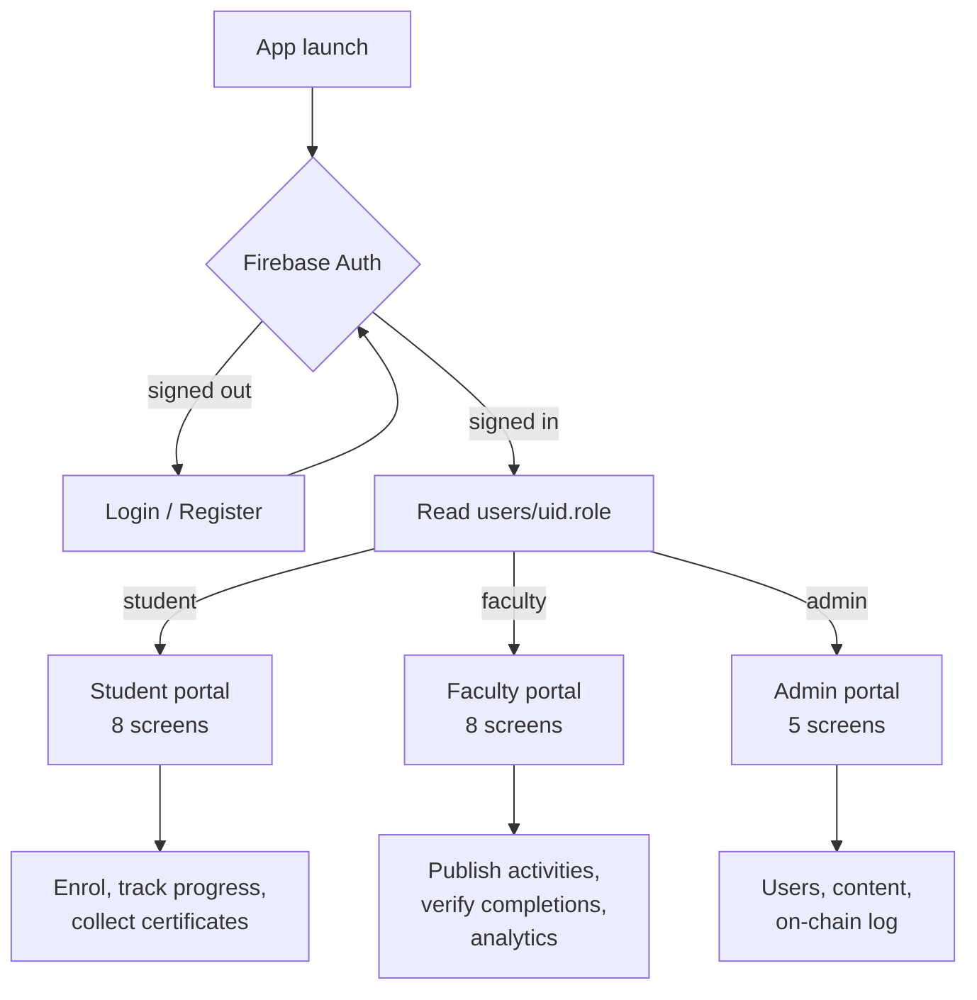
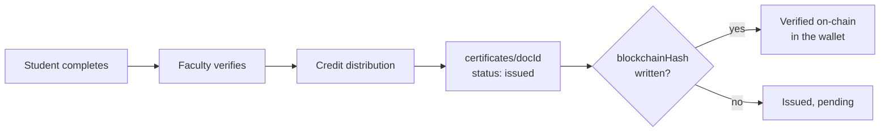

<div align="center">


# UniTrack

**Academic activity and credit management for universities.**
One Flutter codebase, three portals, and a recommendation engine that runs on the device.


</div>

---

Universities hand out credits for workshops, research, bootcamps and volunteering, then track them on spreadsheets that nobody trusts. UniTrack moves that record into one app: students enrol and watch their credits climb toward the sixty they need to graduate, faculty publish activities and verify completions, admins see the whole platform, and every finished activity mints a certificate that carries an Ethereum transaction hash.

## Three portals, one auth gate

Role lives on the user document, not in the client. `AuthGate` holds a `StreamBuilder` on `users/{uid}`, so a role change takes effect the moment it is written, without a restart.



| Portal | What it does |
| :-- | :-- |
| **Student** | Browse and enrol in activities and volunteering, track a four step progress stepper, watch the credit bar move toward 60, hold certificates in a wallet, get ranked against the cohort |
| **Faculty** | Publish activities and volunteering, approve or reject submissions from a three tab verification panel, read six months of participation and credit charts, trigger credit distribution |
| **Admin** | Platform totals, user management, content across all faculty, and an audit trail of certificate issuance |

## The recommendation engine

The part worth reading the code for. No external model and no inference call: every open activity is scored against the student's profile in pure Dart, on the device, after one parallel Firestore read.

```
matchScore = (0.45 × skillOverlap) + (0.35 × interestOverlap) + (0.20 × departmentMatch)
```

| Signal | Weight | Computed as |
| :-- | :-- | :-- |
| Skill overlap | 45% | matched skills ÷ the activity's `required_skills` count |
| Interest overlap | 35% | matched interests ÷ the activity's `category_tags` count |
| Department | 20% | 1.0 if the student's department is targeted, and 1.0 when no department is targeted at all, since that means open to everyone |

The float becomes a 0 to 100 badge, green above 80, blue above 60, amber above 40. Students pick from 32 skills and 26 interests in a collapsible panel; saving writes to `users/{uid}` and re-scores the list immediately.

Every tag field is optional, so the engine shipped without migrating a single existing document. An activity with no tags still scores on department alone, and an item that scores zero is hidden only once the student has actually set a preference. Full write-up in [`AI Recommendation System.md`](AI%20Recommendation%20System.md).

## Three things that were not obvious

**Enrolment is a Firestore transaction.** Two students tapping Enrol on the last seat is a race, and a plain read-then-write loses it. The transaction re-reads the activity, checks capacity and prior enrolment, writes the enrolment and increments the counter, then flips status to `full` on the last seat.

```dart
db.runTransaction((tx) async {
  // re-read capacity, guard duplicates, then write
});
```

**Firestore caps `whereIn` at 30.** The dashboards join enrolments against activities, which blows past that limit the moment a student is busy. Every secondary lookup chunks its ids into thirties and runs the chunks in parallel, which keeps the joins off the N+1 path.

**Live where it matters, cached where it does not.** Feeds use `StreamBuilder` so a seat disappearing is visible without a pull to refresh. Dashboards, profile and the certificate wallet use `FutureBuilder`, because re-rendering a credit total on every unrelated write is cost with no benefit.

## Certificates and wallet linking



Certificates live in Firestore and carry an optional `blockchainHash`. Once that hash is present the wallet renders the certificate as verified on chain and shows the transaction id. Students link an Ethereum wallet through MetaMask from the login or register screen, and each account also gets a decentralised identifier derived from its Firebase uid in the form `did:ethr:0x…`.

## Data model

Six collections. Credits have exactly one home, `users/{uid}.credits`, so no screen has to reconcile a total.

| Collection | Holds |
| :-- | :-- |
| `users` | profile, role, department, credits, plus `skills[]` and `interests[]` for scoring |
| `activities` | title, type, faculty, date, credits, capacity, enrolled, and the three optional tag arrays |
| `volunteering` | category, organisation, participants, skills, tags |
| `enrollments` | userId, activityId, status |
| `applications` | userId, volunteeringId, status |
| `certificates` | userId, type, credits, status, `blockchainHash` |

Both lifecycles run the same four states, with rejection available at any point:

```
Enrolled / Applied  →  Approved  →  Completed  →  Verified
```

## Running it

```bash
flutter pub get
flutter run                  # connected Android device
flutter run -d chrome        # web
flutter build apk --release
```

You will need your own Firebase project. Generate `lib/firebase_options.dart` with the FlutterFire CLI and drop in your own `google-services.json`.

## Design

Dark glassmorphism: blurred translucent cards, neon glow shadows, gradient badges. Student and faculty each have a shared `DashboardLayout` that owns the scaffold, the desktop sidebar and the mobile bottom nav, so a screen is only ever its own content.

| | | | | |
| :-- | :-- | :-- | :-- | :-- |
|  background |  card |  primary |  blue |  cyan |
|  green |  amber |  rose |  text |  muted |

## Documentation

- [`UniTrack.md`](UniTrack.md) every screen, route and field
- [`AI Recommendation System.md`](AI%20Recommendation%20System.md) the scoring engine in full

---

<div align="center">

Built by [Kunal Bhargava](https://github.com/KunalBhargava182)

</div>
